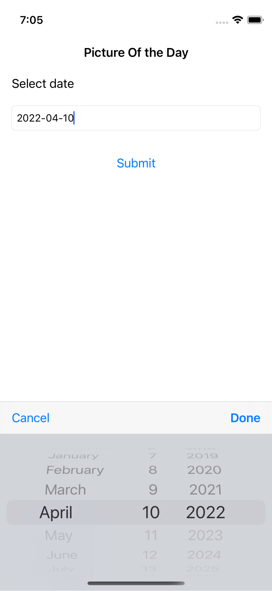
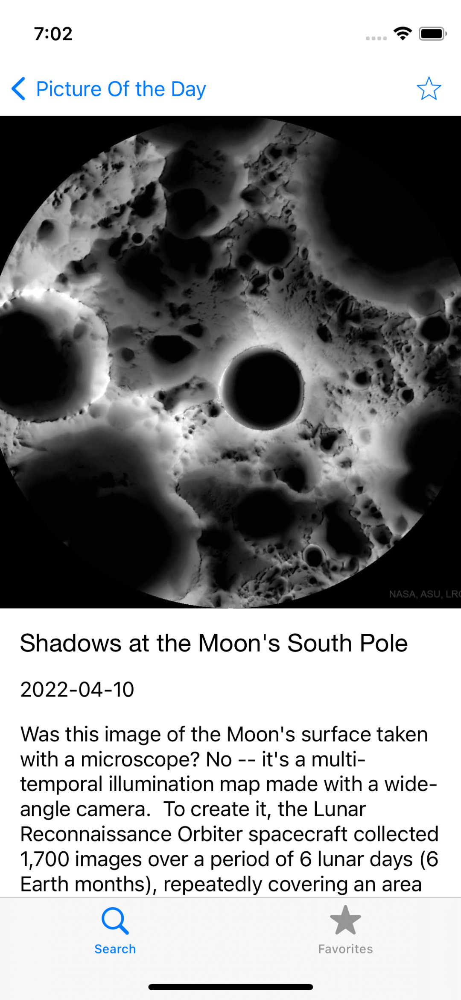
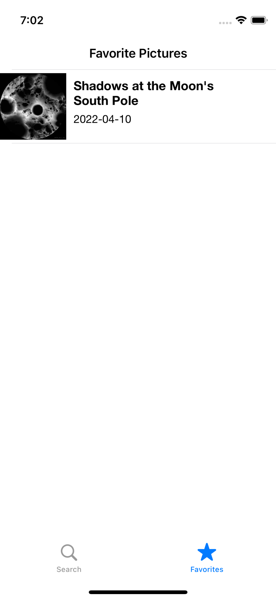

# NASAPod
A mobile app which display NASA’s Astronomy picture of the day

Basic feature -
- Allow users to search for the picture for a date of their choice
- Allow users to create/manage a list of &quot;favorite&quot; listings
- Display date, explanation, Title and the image / video of the day
- App caches information and display last updated information in case of
network unavailability.
- Dark mode support
- App handles different screen sizes, orientations

NASA’s open APIs ( https://api.nasa.gov/ ) and in particular, the APOD (
Astronomy picture of the day ) resource.

ScreenShots 

<h3 align="center">

</h3>

<h3 align="center">

</h3>

<h3 align="center">

</h3>

## Credit
- Data courtesy of [NASA](https://api.nasa.gov) 🛰
- Thanks to [SBWebImage](https://github.com/SDWebImage/SDWebImage) for its web image downloading and caching library 🐟
